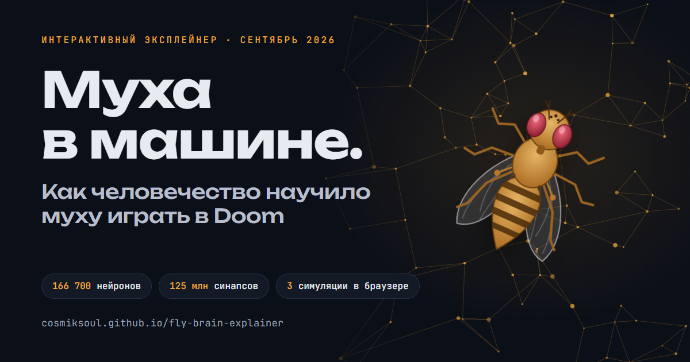

# Муха в машине. Как человечество научило муху играть в Doom

[](https://cosmiksoul.github.io/fly-brain-explainer/)

3 сентября 2026 года Google Research и HHMI Janelia опубликовали MaleCNS, полную карту нервной системы самца дрозофилы: 166 700 нейронов и 125 млн синапсов. Через три дня «мозг мухи» уже играл в Doom, а за следующую неделю успел побывать в Minecraft и Beat Saber и припарковаться в автосимуляторе CARLA. Этот интерактивный эксплейнер разбирает, где в этих роликах биология, где инженерия, а где мем.

Сначала разбираемся с коннектомами MaleCNS и BANC: как из нарезанного мозга получают граф и чего в этом графе нет. Потом смотрим, как LIF-симуляции оживляют проводку и что на самом деле делает муха в хобби-демках с Doom, Minecraft, Beat Saber и CARLA. В конце есть песочница, где игрушечный мозг мухи дёргает рычаг слот-автомата и играет против вас в Hi-Lo. У обеих игр есть кнопка «перемешать проводку». Это контроль, которого не хватает вирусным роликам, и он отличает «мозг научился» от «мы так собрали».

**Читать:** [cosmiksoul.github.io/fly-brain-explainer](https://cosmiksoul.github.io/fly-brain-explainer/), около 25 минут.

## Как устроено

Вся страница помещается в один файл `index.html` размером около 800 КБ. Библиотек, фреймворков и сборки нет, поэтому локально достаточно открыть файл в браузере.

- Интерактивы написаны на ванильном JavaScript, схемы и графики нарисованы на SVG и Canvas.
- Симуляции считаются прямо в браузере: одиночный LIF-нейрон, вкусовая микроцепь на два десятка узлов и три игрушечные LIF-сети на 191, 256 и 340 нейронов (Hi-Lo, слот и Doom-демо). Сети собраны по рецепту Shiu et al. (2024), данных MaleCNS в них нет.
- Пять картинок галереи и иконки сайта вшиты в HTML как data-URI. Отдельным файлом лежит только `og.png` 1200×630, превью для соцсетей.
- Из сети страница загружает только шрифты Google Fonts. Если они недоступны, текст покажется системными шрифтами.
- GitHub Actions (`.github/workflows/pages.yml`) выкладывает корень репозитория на GitHub Pages после каждого пуша в `main`.

```
index.html                    страница целиком: текст, стили, скрипты, картинки
og.png                        превью для соцсетей
.github/workflows/pages.yml   деплой на GitHub Pages без сборки
.nojekyll                     отключает обработку Jekyll
```

## Лицензии

Код страницы (HTML, CSS, JavaScript) распространяется по лицензии MIT, полный текст лежит в [LICENSE](LICENSE).

Тексты эксплейнера и собственные иллюстрации (схемы, графики, превью для соцсетей) доступны по лицензии [CC BY 4.0](https://creativecommons.org/licenses/by/4.0/deed.ru). Их можно копировать и переделывать, если указать автора и лицензию.

На чужие материалы эти лицензии не распространяются. Кадры из видео и иллюстрации Harvard Medical School к статье о BANC (Tyler Sloan), картинка из галереи flywire.ai и кадр проекта Flyhard принадлежат их авторам. Данные и цитаты тоже принадлежат авторам статей и постов. Ссылки на первоисточники собраны в разделе «Источники» на странице.
